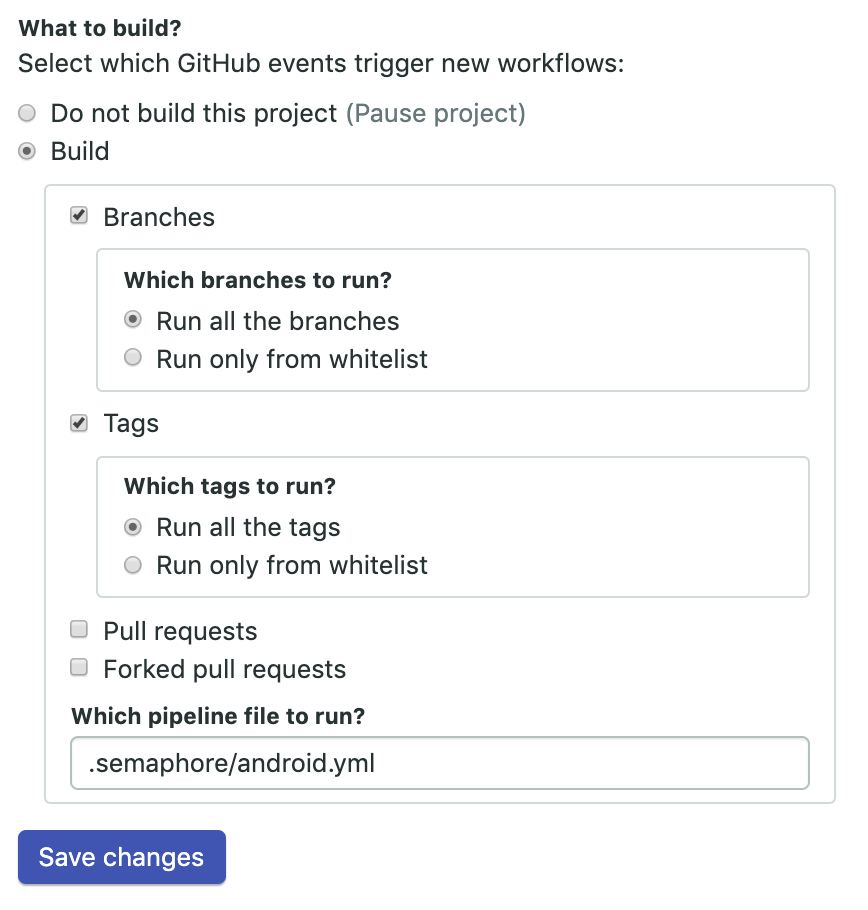

# Semaphore demo CI/CD pipeline using React Native

Example application and CI/CD pipeline showing how to run a React Native project
on Semaphore 2.0. (Uses [React Native CLI Quickstart](https://facebook.github.io/react-native/docs/getting-started.html))

## CI/CD on Semaphore

1. Fork this repository and use it to [create a
project](https://docs.semaphoreci.com/article/63-your-first-project).

The CI pipeline will look like this (iOS):


To run andoroid CI, change pipeline file to run `android.yml`



The CI pipeline will look like this (Android):


The example pipeline contains 4 blocks:

 - Install dependencies
    -  installs and caches all npm dependencies
 - Run linter
    - Lint the code using [eslint](https://eslint.org/) with [@react-native-community/eslint-config](https://www.npmjs.com/package/@react-native-community/eslint-config)
 - Run tests
    - Runs unit and integration tests using [Jest](https://jestjs.io/) and [Enzyme](https://airbnb.io/enzyme/). Runs e2e UI tests using [Detox](https://github.com/wix/Detox)
 - Build app
    - Uses [Fastlane](https://fastlane.tools) as build automation tool (with a refference to [Fastlane — Simple React Native iOS Releases](https://shift.infinite.red/simple-react-native-ios-releases-4c28bb53a97b) and [Fastlane — Simple React Native Android Releases](https://shift.infinite.red/simple-react-native-android-releases-319dc5e29605))

## Local project setup

### Installation

```bash
$ npm install
```

### Running the app

```bash
$ npm start
```

### Lint

```bash
$ npm run lint
```

### Unit and integration tests

```bash
$ npm test
```

### e2e UI tests iOS

```bash
$ npm run detox-ios-build
$ npm run detox-ios-test
```

### e2e UI tests android

```bash
$ npm run detox-android-build
$ npm run detox-android-test
```

## License

Copyright (c) 2019 Rendered Text

Distributed under the MIT License. See the file [LICENSE.md](./LICENSE.md).
